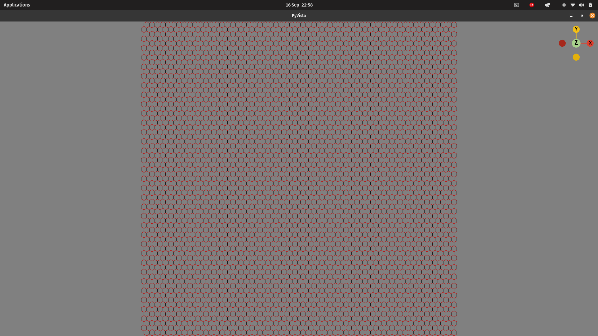
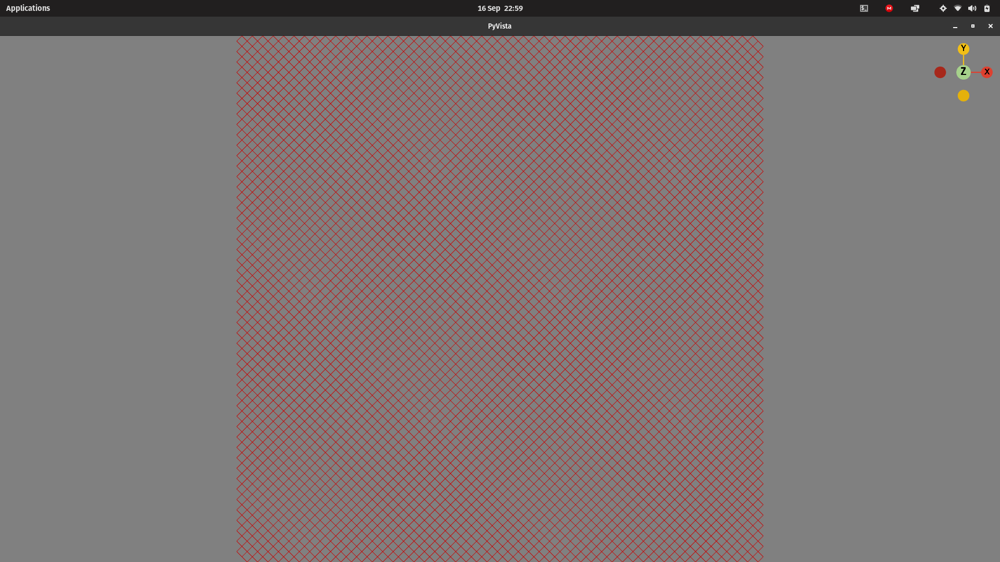

<div align="center">

[](https://github.com/gbene/SirGridsAlot/releases/)
[](#license)
[](https://github.com/gbene/SirGridsAlot/issues)
[](https://python.org "Go to Python homepage")


</div>


Rapidly create and plot in 2D/3D diamond or hex grids with Python.


# Installation

For now clone the repository and install the necessary packages using the 
provided requirements.txt file

```sh
$ pip install -r requirements.txt
```


# Quick example

Create a 100x100 hexagonal and diamond grids enclosed in a circle of radius 1:

```python
import grids
import numpy as np


area_bounds = np.array([0, 0, 100, 100])

hex_grid = grids.gen_grid(area_bounds, r=1, n_sides=6)

dia_grid = grids.gen_grid(area_bounds, r=1, n_sides = 4)
```

Plot such grids:

```python
from helpers import plot_grid

plot_grid.plot_grid_3d(hex_grid)
plot_grid.plot_grid_3d(dia_grid)
```
<details>
<summary> Hexagonal grid result </summary>



</details>

<details>

<summary>Diamond grid result</summary>



</details>

# Performance comparison

SirGridsAlot is much faster than other libraries here is a comparison 
with the beautiful [hexalattice](https://github.com/alexkaz2/hexalattice) library.


```python
import grids
import numpy as np

from hexalattice.hexalattice import *
import time

nx = 1000
ny = 1000


start_lat = time.time()
hex_centers, _ = create_hex_grid(nx=nx,
                                 ny=ny,
                                 do_plot=True)
end_lat = time.time()

print(f'time hexalattice (s): {end_lat - start_lat}')
# time hexalattice (s): 71.37401556968689

area_bounds = np.array([0, 0, nx, ny])


start_sir = time.time()
grid = grids.gen_grid(area_bounds, r=1, n_sides=6)
end_sir = time.time()

print(f' time sirgridsalot (s): {end_sir - start_sir}')
# time sirgridsalot (s): 0.33207154273986816

print(f'time increase: {(end_lat - start_lat) / (end_sir - start_sir)}')
# time increase: 215
```
That is an impressive time increase (x215 factor) in creating a plottable grid (i.e. not generating only the cell centers).

This is possible thanks to an original approach for creating grids.  

# TODOs

+ [ ] Create grids inside any generic closed loop
+ [ ] Plot grids in matplotlib
+ [ ] Export grids as shapefiles
+ [ ] Support triangles
+ [ ] Support grid operations (i.e. cut objects that intersect grids, calculate densities and so on)